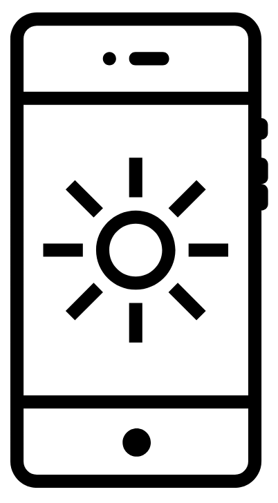

# Bitflipped
_Your computer is a cosmic ray detector. Literally._

---

Cosmic rays hit computer RAM all the time. If your RAM is not ECC protected, it will likely flip a random bit. A single bit in billions of bits. Does it matter? [Yes. Yes it does.](https://twitter.com/whitequark/status/980522328151834624)

Bit flips manifest in many ways - computer clusters suddenly dying, data silently being corrupted, and even [squatting on domain names that are a bit adjacent](http://dinaburg.org/bitsquatting.html).

To start your very own bit flip detector, simply run `make` and `./bitflip`. If you redirect the The source code has no dependencies and is worryingly simple.

Detection is via allocating a slice of zeroed memory, in our case a gigabyte, and then once per minute going through to ensure they're actually all zeroes. Magic!

**Pro-tips:**
+ Don't run this on expensive equipment as it may have ECC RAM which will ruin your fun
+ The bigger your RAM, the bigger your detector, so use a desktop's RAM if you can
+ The background radiation from cosmic rays increases with altitude, from 0.3 mSv per year for sea-level areas to 1.0 mSv per year for higher-altitude cities, so for best results use this on a plane or in outer space
+ Beware smart memory systems - the Mac will compress least unused chunks of memory when running low on RAM and zeroes would compress quite well, effectively reducing the size of your cosmic ray detector =\[

**Thanks to:**
+ Thanks to [Brightness by Chameleon Design from the Noun Project](https://thenounproject.com/search/?q=brightness&i=374305) for the logo
+ Our computers for putting up with unsafe workplaces
